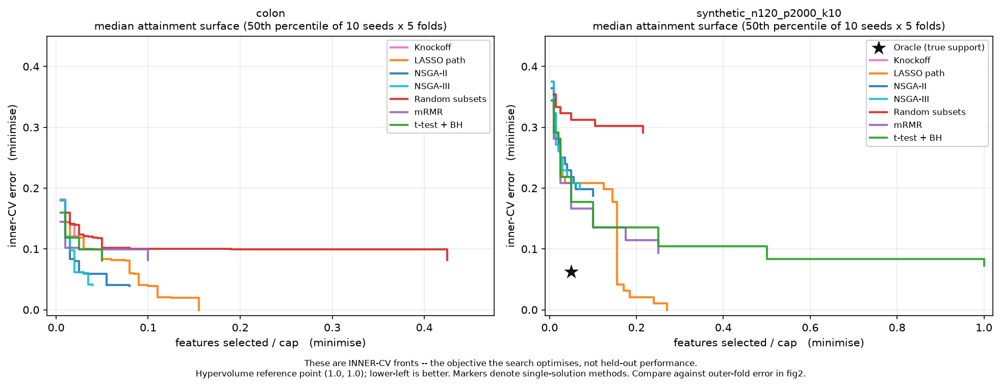
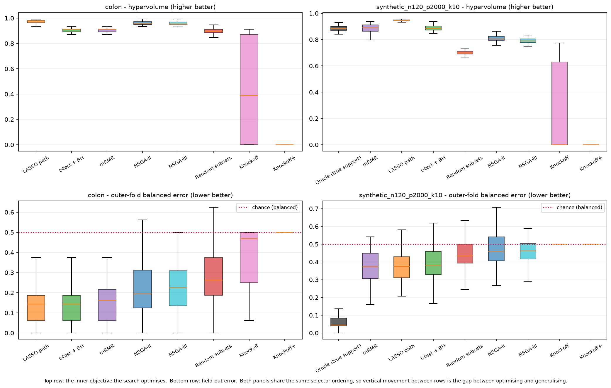
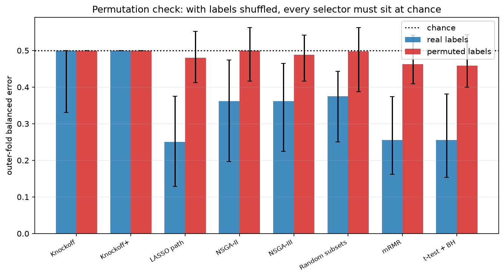

# Results

Generated from `850` fold results (892.3s wall clock).

- Hypervolume reference point: `(1.0, 1.0)`, size axis normalised by `200` (the cardinality cap)
- Indicator backend: `moocore`
- Master seed `20260914`, 10 seeds x 5 outer folds
- Evolutionary budget: 30 x 30 = 900 evaluations, matched exactly by the random-subset ablation

## Datasets

- **synthetic_n120_p2000_k10** - n=120, p=2000, `sha256:a4ec18b4b17045ca`  
  simulated (make_synthetic(seed=1)); preprocessing: block-equicorrelated gaussian, rho=0.3, block=50
- **colon** - n=62, p=2000, `sha256:f732928b8130b159`  
  OpenML (data_id=45087); preprocessing: numeric columns only, z-scored per feature (label-independent)

## Table 1 - headline results, median [IQR]

| dataset                  | selector              | balanced error       | features                   | hypervolume          | precision            | recall               |
|:-------------------------|:----------------------|:---------------------|:---------------------------|:---------------------|:---------------------|:---------------------|
| synthetic_n120_p2000_k10 | NSGA-II               | 0.458 [0.406, 0.542] | 14.500 [9.500, 20.500]     | 0.805 [0.794, 0.826] | 0.000 [0.000, 0.062] | 0.000 [0.000, 0.100] |
| synthetic_n120_p2000_k10 | NSGA-III              | 0.462 [0.417, 0.503] | 9.000 [6.250, 11.000]      | 0.789 [0.775, 0.805] | 0.061 [0.000, 0.167] | 0.100 [0.000, 0.100] |
| synthetic_n120_p2000_k10 | Random subsets        | 0.434 [0.392, 0.500] | 22.000 [10.000, 64.000]    | 0.699 [0.689, 0.711] | 0.000 [0.000, 0.026] | 0.000 [0.000, 0.100] |
| synthetic_n120_p2000_k10 | t-test + BH           | 0.381 [0.329, 0.458] | 100.000 [100.000, 200.000] | 0.886 [0.872, 0.903] | 0.060 [0.045, 0.090] | 0.700 [0.700, 0.900] |
| synthetic_n120_p2000_k10 | mRMR                  | 0.374 [0.305, 0.449] | 50.000 [35.000, 50.000]    | 0.890 [0.864, 0.913] | 0.140 [0.104, 0.171] | 0.550 [0.500, 0.600] |
| synthetic_n120_p2000_k10 | LASSO path            | 0.375 [0.311, 0.429] | 54.500 [49.000, 61.750]    | 0.946 [0.942, 0.949] | 0.136 [0.116, 0.162] | 0.700 [0.700, 0.800] |
| synthetic_n120_p2000_k10 | Knockoff+             | 0.500 [0.500, 0.500] | 0.000 [0.000, 0.000]       | 0.000 [0.000, 0.000] | 0.000 [0.000, 0.000] | 0.000 [0.000, 0.000] |
| synthetic_n120_p2000_k10 | Knockoff              | 0.500 [0.500, 0.500] | 0.000 [0.000, 1.000]       | 0.000 [0.000, 0.630] | 0.000 [0.000, 0.000] | 0.000 [0.000, 0.000] |
| synthetic_n120_p2000_k10 | Oracle (true support) | 0.044 [0.038, 0.083] | 10.000 [10.000, 10.000]    | 0.886 [0.871, 0.901] | 1.000 [1.000, 1.000] | 1.000 [1.000, 1.000] |
| colon                    | NSGA-II               | 0.194 [0.125, 0.312] | 8.000 [6.000, 12.000]      | 0.955 [0.949, 0.972] | -                    | -                    |
| colon                    | NSGA-III              | 0.225 [0.134, 0.309] | 7.000 [5.000, 9.000]       | 0.953 [0.951, 0.971] | -                    | -                    |
| colon                    | Random subsets        | 0.263 [0.188, 0.375] | 15.000 [8.250, 26.250]     | 0.896 [0.885, 0.911] | -                    | -                    |
| colon                    | t-test + BH           | 0.144 [0.062, 0.188] | 5.000 [2.000, 5.000]       | 0.913 [0.891, 0.915] | -                    | -                    |
| colon                    | mRMR                  | 0.163 [0.062, 0.216] | 5.000 [2.000, 10.000]      | 0.911 [0.892, 0.915] | -                    | -                    |
| colon                    | LASSO path            | 0.144 [0.062, 0.188] | 24.500 [20.250, 30.750]    | 0.980 [0.963, 0.982] | -                    | -                    |
| colon                    | Knockoff+             | 0.500 [0.500, 0.500] | 0.000 [0.000, 0.000]       | 0.000 [0.000, 0.000] | -                    | -                    |
| colon                    | Knockoff              | 0.469 [0.250, 0.500] | 0.500 [0.000, 1.000]       | 0.387 [0.000, 0.870] | -                    | -                    |

## Table 2 - across-fold support stability (Jaccard)

| dataset                  | selector              |   jaccard_median |   jaccard_mean |   n_pairs |
|:-------------------------|:----------------------|-----------------:|---------------:|----------:|
| synthetic_n120_p2000_k10 | NSGA-II               |            0     |          0.011 |       100 |
| synthetic_n120_p2000_k10 | NSGA-III              |            0     |          0.009 |       100 |
| synthetic_n120_p2000_k10 | Random subsets        |            0     |          0.008 |       100 |
| synthetic_n120_p2000_k10 | t-test + BH           |            0.255 |          0.252 |       100 |
| synthetic_n120_p2000_k10 | mRMR                  |            0.222 |          0.221 |       100 |
| synthetic_n120_p2000_k10 | LASSO path            |            0.181 |          0.184 |       100 |
| synthetic_n120_p2000_k10 | Knockoff+             |          nan     |        nan     |         0 |
| synthetic_n120_p2000_k10 | Knockoff              |            0     |          0.15  |        10 |
| synthetic_n120_p2000_k10 | Oracle (true support) |            1     |          1     |       100 |
| colon                    | NSGA-II               |            0     |          0.004 |       100 |
| colon                    | NSGA-III              |            0     |          0.01  |       100 |
| colon                    | Random subsets        |            0     |          0.005 |       100 |
| colon                    | t-test + BH           |            0.277 |          0.314 |       100 |
| colon                    | mRMR                  |            0.25  |          0.249 |       100 |
| colon                    | LASSO path            |            0.187 |          0.197 |       100 |
| colon                    | Knockoff+             |          nan     |        nan     |         0 |
| colon                    | Knockoff              |            0.292 |          0.238 |        26 |

## Table 3 - budget actually spent (unique objective evaluations per fold)

The random-subset ablation is only meaningful if random received the same budget as the evolutionary search. Configured budget is 30 x 30 = 900; NSGA-II's *unique* count falls below that wherever the search re-visited solutions and the objective cache absorbed the duplicates.

| dataset                  | selector              |   median |   q1 |   q3 |
|:-------------------------|:----------------------|---------:|-----:|-----:|
| colon                    | Knockoff              |        0 |    0 |    1 |
| colon                    | Knockoff+             |        0 |    0 |    0 |
| colon                    | LASSO path            |        7 |    7 |    7 |
| colon                    | NSGA-II               |      886 |  883 |  889 |
| colon                    | NSGA-III              |      890 |  888 |  894 |
| colon                    | Random subsets        |      900 |  900 |  900 |
| colon                    | mRMR                  |        7 |    7 |    7 |
| colon                    | t-test + BH           |        9 |    9 |    9 |
| synthetic_n120_p2000_k10 | Knockoff              |        0 |    0 |    1 |
| synthetic_n120_p2000_k10 | Knockoff+             |        0 |    0 |    0 |
| synthetic_n120_p2000_k10 | LASSO path            |        7 |    7 |    7 |
| synthetic_n120_p2000_k10 | NSGA-II               |      888 |  884 |  892 |
| synthetic_n120_p2000_k10 | NSGA-III              |      891 |  886 |  894 |
| synthetic_n120_p2000_k10 | Oracle (true support) |        1 |    1 |    1 |
| synthetic_n120_p2000_k10 | Random subsets        |      900 |  900 |  900 |
| synthetic_n120_p2000_k10 | mRMR                  |        7 |    7 |    7 |
| synthetic_n120_p2000_k10 | t-test + BH           |        8 |    8 |    8 |

## Table 4 - statistical comparison

Friedman across selectors with (dataset, seed, fold) as blocks; post-hoc pairwise Wilcoxon signed-rank with Holm correction, run only where Friedman was significant; Cliff's delta against the top-ranked selector.

### colon

**hypervolume** (higher is better), 50 blocks  
Friedman chi2 = 314.49, p = 4.858e-64

Mean ranks (1 = best): `LASSO path` 1.34, `NSGA-II` 2.26, `NSGA-III` 2.46, `mRMR` 4.87, `t-test + BH` 4.93, `Random subsets` 5.30, `Knockoff` 7.09, `Knockoff+` 7.75

Cliff's delta vs **LASSO path** (raw per-block values):

| selector       |   delta | magnitude   |
|:---------------|--------:|:------------|
| Knockoff       |   1     | large       |
| Knockoff+      |   1     | large       |
| NSGA-II        |   0.534 | large       |
| NSGA-III       |   0.632 | large       |
| Random subsets |   0.978 | large       |
| mRMR           |   0.991 | large       |
| t-test + BH    |   0.99  | large       |

Holm-corrected pairwise p-values

|                |   Knockoff |   Knockoff+ |   LASSO path |   NSGA-II |   NSGA-III |   Random subsets |    mRMR |   t-test + BH |
|:---------------|-----------:|------------:|-------------:|----------:|-----------:|-----------------:|--------:|--------------:|
| Knockoff       |      1     |       7e-05 |       0      |   0       |    0       |          0       | 0       |       0       |
| Knockoff+      |      7e-05 |       1     |       0      |   0       |    0       |          0       | 0       |       0       |
| LASSO path     |      0     |       0     |       1      |   0.0004  |    3e-05   |          0       | 0       |       0       |
| NSGA-II        |      0     |       0     |       0.0004 |   1       |    0.45202 |          0       | 0       |       0       |
| NSGA-III       |      0     |       0     |       3e-05  |   0.45202 |    1       |          0       | 0       |       0       |
| Random subsets |      0     |       0     |       0      |   0       |    0       |          1       | 0.43806 |       0.4295  |
| mRMR           |      0     |       0     |       0      |   0       |    0       |          0.43806 | 1       |       0.98195 |
| t-test + BH    |      0     |       0     |       0      |   0       |    0       |          0.4295  | 0.98195 |       1       |

**outer_balanced_error** (lower is better), 50 blocks  
Friedman chi2 = 190.74, p = 1.047e-37

Mean ranks (1 = best): `t-test + BH` 2.78, `LASSO path` 2.89, `mRMR` 2.98, `NSGA-II` 4.13, `NSGA-III` 4.53, `Random subsets` 5.05, `Knockoff` 5.96, `Knockoff+` 7.68

Cliff's delta vs **t-test + BH** (raw per-block values):

| selector       |   delta | magnitude   |
|:---------------|--------:|:------------|
| Knockoff       |  -0.693 | large       |
| Knockoff+      |  -1     | large       |
| LASSO path     |   0.009 | negligible  |
| NSGA-II        |  -0.382 | medium      |
| NSGA-III       |  -0.394 | medium      |
| Random subsets |  -0.564 | large       |
| mRMR           |  -0.042 | negligible  |

Holm-corrected pairwise p-values

|                |   Knockoff |   Knockoff+ |   LASSO path |   NSGA-II |   NSGA-III |   Random subsets |    mRMR |   t-test + BH |
|:---------------|-----------:|------------:|-------------:|----------:|-----------:|-----------------:|--------:|--------------:|
| Knockoff       |    1       |     0.00019 |      0       |   0.00628 |    0.00028 |          0.03391 | 0       |       0       |
| Knockoff+      |    0.00019 |     1       |      0       |   0       |    0       |          0       | 0       |       0       |
| LASSO path     |    0       |     0       |      1       |   0.00576 |    0.0021  |          1e-05   | 1       |       1       |
| NSGA-II        |    0.00628 |     0       |      0.00576 |   1       |    1       |          0.22578 | 0.00747 |       0.00423 |
| NSGA-III       |    0.00028 |     0       |      0.0021  |   1       |    1       |          0.08461 | 0.00228 |       0.00083 |
| Random subsets |    0.03391 |     0       |      1e-05   |   0.22578 |    0.08461 |          1       | 7e-05   |       1e-05   |
| mRMR           |    0       |     0       |      1       |   0.00747 |    0.00228 |          7e-05   | 1       |       1       |
| t-test + BH    |    0       |     0       |      1       |   0.00423 |    0.00083 |          1e-05   | 1       |       1       |

### synthetic_n120_p2000_k10

**hypervolume** (higher is better), 50 blocks  
Friedman chi2 = 379.91, p = 3.705e-77

Mean ranks (1 = best): `LASSO path` 1.00, `t-test + BH` 2.95, `mRMR` 2.99, `Oracle (true support)` 3.14, `NSGA-II` 5.16, `NSGA-III` 5.76, `Random subsets` 7.08, `Knockoff` 8.25, `Knockoff+` 8.67

Cliff's delta vs **LASSO path** (raw per-block values):

| selector              |   delta | magnitude   |
|:----------------------|--------:|:------------|
| Knockoff              |   1     | large       |
| Knockoff+             |   1     | large       |
| NSGA-II               |   1     | large       |
| NSGA-III              |   1     | large       |
| Oracle (true support) |   1     | large       |
| Random subsets        |   1     | large       |
| mRMR                  |   0.99  | large       |
| t-test + BH           |   0.989 | large       |

Holm-corrected pairwise p-values

|                       |   Knockoff |   Knockoff+ |   LASSO path |   NSGA-II |   NSGA-III |   Oracle (true support) |   Random subsets |   mRMR |   t-test + BH |
|:----------------------|-----------:|------------:|-------------:|----------:|-----------:|------------------------:|-----------------:|-------:|--------------:|
| Knockoff              |    1       |     0.00146 |            0 |   0       |    0       |                       0 |                0 |      0 |             0 |
| Knockoff+             |    0.00146 |     1       |            0 |   0       |    0       |                       0 |                0 |      0 |             0 |
| LASSO path            |    0       |     0       |            1 |   0       |    0       |                       0 |                0 |      0 |             0 |
| NSGA-II               |    0       |     0       |            0 |   1       |    0.00156 |                       0 |                0 |      0 |             0 |
| NSGA-III              |    0       |     0       |            0 |   0.00156 |    1       |                       0 |                0 |      0 |             0 |
| Oracle (true support) |    0       |     0       |            0 |   0       |    0       |                       1 |                0 |      1 |             1 |
| Random subsets        |    0       |     0       |            0 |   0       |    0       |                       0 |                1 |      0 |             0 |
| mRMR                  |    0       |     0       |            0 |   0       |    0       |                       1 |                0 |      1 |             1 |
| t-test + BH           |    0       |     0       |            0 |   0       |    0       |                       1 |                0 |      1 |             1 |

**outer_balanced_error** (lower is better), 50 blocks  
Friedman chi2 = 199.27, p = 9.096e-39

Mean ranks (1 = best): `Oracle (true support)` 1.00, `mRMR` 3.84, `LASSO path` 3.95, `t-test + BH` 4.49, `Random subsets` 5.71, `NSGA-III` 5.99, `NSGA-II` 6.17, `Knockoff` 6.70, `Knockoff+` 7.15

Cliff's delta vs **Oracle (true support)** (raw per-block values):

| selector       |   delta | magnitude   |
|:---------------|--------:|:------------|
| Knockoff       |  -1     | large       |
| Knockoff+      |  -1     | large       |
| LASSO path     |  -0.998 | large       |
| NSGA-II        |  -1     | large       |
| NSGA-III       |  -1     | large       |
| Random subsets |  -1     | large       |
| mRMR           |  -1     | large       |
| t-test + BH    |  -1     | large       |

Holm-corrected pairwise p-values

|                       |   Knockoff |   Knockoff+ |   LASSO path |   NSGA-II |   NSGA-III |   Oracle (true support) |   Random subsets |    mRMR |   t-test + BH |
|:----------------------|-----------:|------------:|-------------:|----------:|-----------:|------------------------:|-----------------:|--------:|--------------:|
| Knockoff              |    1       |     0.75118 |      0       |   0.80523 |    0.14821 |                       0 |          0.42804 | 0       |       0.0001  |
| Knockoff+             |    0.75118 |     1       |      0       |   0.07042 |    0.0067  |                       0 |          0.04948 | 0       |       1e-05   |
| LASSO path            |    0       |     0       |      1       |   0.00307 |    0.0008  |                       0 |          0.00083 | 1       |       0.80523 |
| NSGA-II               |    0.80523 |     0.07042 |      0.00307 |   1       |    1       |                       0 |          1       | 0.00026 |       0.03214 |
| NSGA-III              |    0.14821 |     0.0067  |      0.0008  |   1       |    1       |                       0 |          1       | 0.0001  |       0.00898 |
| Oracle (true support) |    0       |     0       |      0       |   0       |    0       |                       1 |          0       | 0       |       0       |
| Random subsets        |    0.42804 |     0.04948 |      0.00083 |   1       |    1       |                       0 |          1       | 0.00425 |       0.01708 |
| mRMR                  |    0       |     0       |      1       |   0.00026 |    0.0001  |                       0 |          0.00425 | 1       |       0.43399 |
| t-test + BH           |    0.0001  |     1e-05   |      0.80523 |   0.03214 |    0.00898 |                       0 |          0.01708 | 0.43399 |       1       |

## Table 5 - permutation check

Labels shuffled before splitting. Balanced error must sit at chance (0.5). Anything meaningfully below it means selection saw the outer test fold.

| selector       |   permuted |   real labels |
|:---------------|-----------:|--------------:|
| Knockoff       |      0.5   |         0.5   |
| Knockoff+      |      0.5   |         0.5   |
| LASSO path     |      0.48  |         0.25  |
| NSGA-II        |      0.5   |         0.362 |
| NSGA-III       |      0.489 |         0.361 |
| Random subsets |      0.498 |         0.375 |
| mRMR           |      0.462 |         0.255 |
| t-test + BH    |      0.458 |         0.255 |

**Verdict: PASS** (lowest permuted median = 0.458)

## Figures

